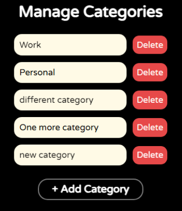

# TodoNest

TodoNest is a feature-rich, modern to-do list application designed to help users efficiently manage their tasks. Built with React.js as part of the KodNest hiring process to evaluate my expertise in frontend development, this project showcases seamless task management and categorization, real-time progress tracking, and persistent local data storage. Its clean and intuitive interface, centered around a Kanban board design, ensures a smooth and engaging user experience.

## Features

### 1. Task Management
- Create new tasks effortlessly.
- Update tasks with details such as name, category, date, and current status.
- Remove tasks when no longer needed.
- Flexible task statuses:
  - Not started
  - In progress
  - Completed

### 2. Task Categorization
- Group tasks into user-defined categories like Work, Personal, or School.
- Manage categories via a simple modal interface for adding or deleting groups.

### 3. Real-Time Progress Tracking
- View task completion percentages with progress bar for:
  - Individual categories
  - Overall progress across all tasks

### 4. Local Data Persistence
- Allowing data to persist across browser sessions using LocalStorage API.

### 5. Modern Design
- Kanban-style task organization with columns for "Not Started", "In Progress", and "Done".
- Hover interactions to reveal quick edit and delete options for tasks.
- Clean, responsive design built with CSS for an engaging user experience.

## Tech Stack

### Frontend
- **React.js**: Core library for building the user interface.
- **Context API**: State management for tasks and categories.
- **CSS/TailwindCSS**: Styling for a modern, user-friendly design.
- **Local Storage**: Data persistence across sessions.

## Snapshots

### 1. Task Manager
Kanban board-style task display with three columns:
- Not Started
- In Progress
- Done

Each task card includes task content and its category.

### 2. Edit Task Menu
Edit task name, category, date, and status (Not Started, In Progress, Done). Save changes or close the window.

### 4. Navbar
- Logo
- Date selector
- Overall task completion progress bar
- Selected category task progress bar

### 5. Task Card
Each task is represented by a card showing:
- Task name
- Category tag
Hovering reveals edit (pencil) and delete (bin) icons.

### 1. Manage Categories
A modal window to create and delete task categories.

## Live Demo

Check out the deployed application: [TodoNest](https://todonest-kodnest-assignment.vercel.app/)

## Future Enhancements
- Add drag-and-drop functionality for task cards in the Kanban board.
- Integrate a backend for multi-user support.
- Add due date reminders and notifications.
- Implement dark mode for the UI.

## Acknowledgements
Special thanks to [KodNest](https://www.kodnest.com/) for inspiring this project and providing the requirements.
